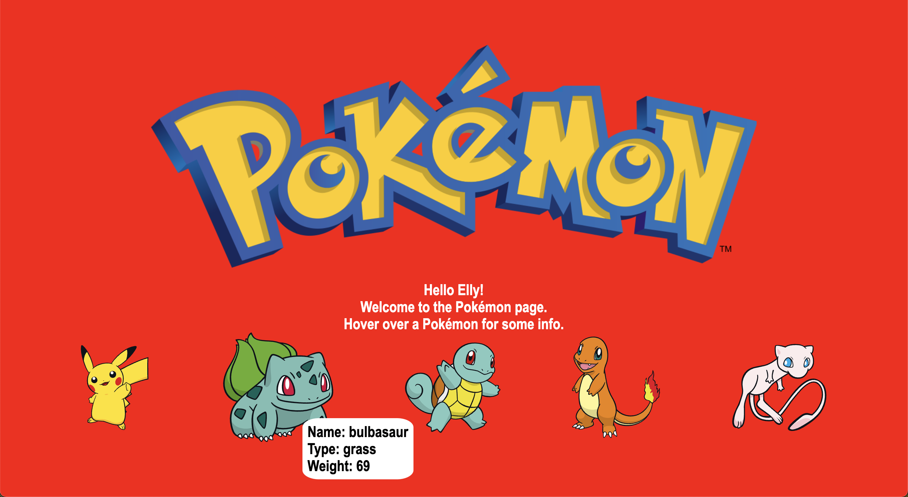

# Fetch Hackathon

Today, we will be using our newfound skills to make apps that request data from a server.

## Pokemon API

- [Pokemon API](https://pokeapi.co/)

# Plan

- Have a nice title
- Greet user

- Import images from API for each pokemon
  - fetch data from API
  - get pokemon image from data
  - create new image tag
  - add new image tag to images div
  - set src of new image tag to image from data
  - add class
  - add id

- Get info for each pokemon from previous fetch
- display info in lists
  - get name
  - create new li tag
  - add new li tag to ul
  - set inner text of new li to pokeName
  - add id
  - add class

- Repeat for type and weight of each pokemon
- Add some CSS to style elements on page

### How it looks:

---
